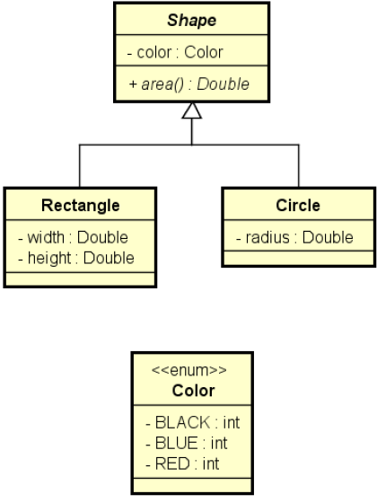

# Classes e Métodos Abstratos
Material didático para exemplificar o uso de classes e métodos abstratos em JAVA.

Fazer um programa para ler os dados de N figuras (N fornecido pelo usuário), e depois mostrar as áreas destas figuras na mesma ordem em que foram digitadas.

